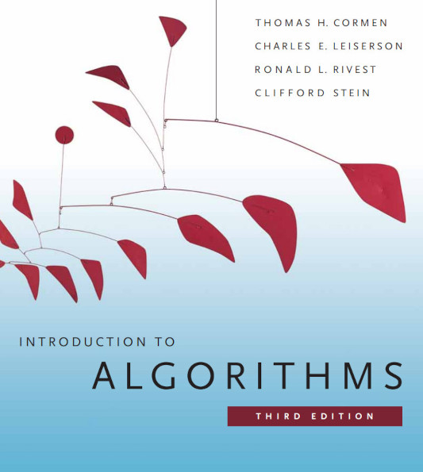

# Análise de Algoritmos e Entrevistas Técnicas

### Professores: 
Fabio Lubacheski ([fabioagl@insper.edu.br](mailto:fabioagl@insper.edu.br))
Leonardo Moraes ([leonardomm8@insper.edu.br](mailto:leonardomm8@insper.edu.br))

---

# Critério de avaliação

Para ser aprovado, o aluno deve obter **Média Final (MF)** maior ou igual a **5**. 

$MF = 0,7*Provas + 0,2 * APS + 0,1 * Entrevistas$

A **Média das Provas (MP)** é calculada conforme abaixo

$MP =  MAX((P1 + 2*P2 + 4*P3)/7, ((3*P2 + 4*P3)/7)$

Em caso de **avaliação substitutiva**, a nota substituirá a prova que maximizar a média final.

---

# Delta

Ao final do semestre, caso o aluno possua **média final maior ou igual a 5**, mas estiver bloqueado por um critério de barreira de aprovação (**média das provas menor que 5**), a **prova substitutiva** será considerada como **prova delta**. A **nota da delta deve ser maior ou igual a 5** para a aprovação na disciplina. Caso contrário, o aluno estará reprovado na disciplina (mesmo que tiver média superior a 5).

--- 

# Bibliografia básica

### Algoritmos: Teoria e Prática
### CORMEN, T. H.; LEISERSON, C. E.; RIVEST, R. L; STEIN, C.
### site: http://mitpress.mit.edu/algorithms/

## Este livro é realmente muito importante para disciplina!

---

# O que iremos aprender na disciplina ?

* Nessa disciplina iremos aprender a medir a eficiência de algoritmos, ou seja, calcular o **tempo de execução** do algoritmo.

* A partir do **tempo de execução** do algoritmo é possível comparar algoritmos que resolvam um mesmo problema.

---
# Como calcular o **tempo de execução** de um algoritmo ? 

> Para obter o **tempo de execução** de um algoritmo poderíamos implementar o algoritmo e realizar vários testes para várias entradas. Mas ai surge algumas questões:

* O hardware (memória,  processador, disco, etc..) influencia ? 

* E qual a influência do software (SO, linguagem de programação, compilador, código é intretado, etc ) ?

* Nesse caso, você estaria comparando **implementações**, e não **algoritmos**.

---
# Como calcular o **tempo de execução** de um algoritmo ? 

* Podemos **abstrair** o problema, ou seja, focar propriedades essenciais para calcular o **tempo de execução**, desconsiderando os detalhes de implementação que não são relevantes para o nível de análise realizado.

* Em vez de perguntar

    * "**Quantos segundos** o algoritmo demora?"

* Perguntamos
 
    * "**Quantas operações** o algoritmo executa em função do tamanho da entrada?"

---
# Considere o algorimo que soma elementos de um vetor
$SomaVetor(A)$
$1. \ soma = 0$
$2. \ para \ i = 1 \ até  \ |A|$
$3. \qquad soma = soma + A[i]$
$4. \qquad i = i + 1$
$5. \ retorne \ soma$
* Nesse caso não consideramos **se**:
    * a soma demora $1 ns$ ou $5 ns$;
    * o código foi escrito em `C`, `Java` ou `Python;
    * o processador possui *cache L3*.

---
# Formalizando a contagem de operações do algoritmo

O que importa é que o laço é executado aproximadamente **n** vezes.

Assim, modelamos o **tempo de execução** por uma função do **tamanho da entrada**, como:

$T(n) = an + b$

onde:
    $a$ representa o custo constante de cada iteração;
    $b$ representa o custo fixo antes e depois do laço.

---

# Contagem de operações do algoritmo
Agora vamos contar aproximadamente as operações.

| Operação             | Quantidade |
| -------------------- | ---------: |
| $soma = 0$           |          1 |
| $i = 1$              |          1 |
| $ate \ \vert A \vert$  |      n + 1 |
| $soma = soma + A[i]$ |          n |
| $i = i + 1$          |          n |
| $retorna \ soma$       |          1 |

---
# Abstração em Análise de Algoritmos

Somando tudo:
$T(n)=1+1+(n+1)+n+n+1$

ou

$T(n)=3n+4$
$a=3$ 
$b=4$

* Podemos dizer que a complexidade assintótica do algoritmo $SomaVetor(A)$ é $O(n)$. **Concordam ??**

---

# Abstração em Análise de Algoritmos

#### Na Análise de Algoritmos, a abstração consiste em ignorar os detalhes específicos da implementação — como linguagem de programação, compilador e hardware — e representar o **custo de um algoritmo apenas em função do tamanho da entrada**. 

#### Essa abstração permite comparar algoritmos de maneira geral, utilizando funções matemáticas e notações assintóticas, como $O$, $Θ$ e $Ω$.

---

# Objetivos da Disciplina

1. **Identificar** e **demonstrar** a complexidade de espaço e tempo de algoritmos utilizando notação assintótica;

2. **Projetar** e **implementar** algoritmos utilizando divisão e conquista, programação dinâmica e estratégias gulosas;

3. **Descrever** as intuições e funcionamento de algoritmos no contexto de **entrevistas técnicas de programação**.

---
# Entrevistas Técnicas de Programação

* Uma entrevista técnica é um processo de avaliação em que o candidato deve demonstrar sua capacidade de resolver problemas, justificando suas escolhas e avaliando a eficiência das soluções utilizando conceitos como complexidade;

* Normalmente utilizado no processo seletivo em empresas de tecnologia (Google, Microsoft, Amazon, Meta, Nubank, iFood, entre outras);

* **Exemplo de Problema**: Dado uma sequencia de números inteiros, determine a maior diferença absoluta entre dois elementos da sequência ?

---
# Como seria uma entrevista técnica
 
* Entendimento do problema, caso não esteja claro faça perguntas para evitar ambiguidade;

* Proponha uma solução, mesmo usando força-bruta;

* Análise de solução e definição da complexidade da solução;

* Propor melhorias na solução de forma a diminuir a complexidade;

* A solução funciona para todos os casos;

---

# Obrigado !